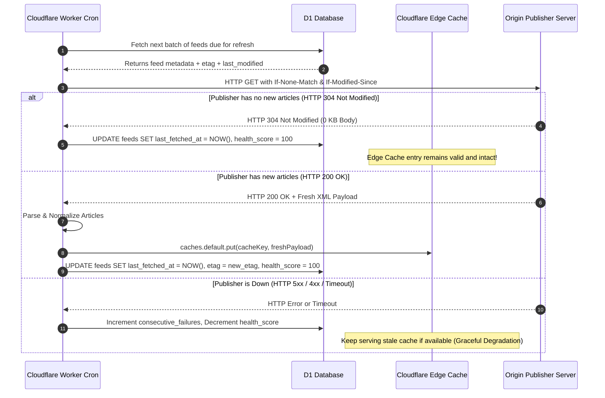
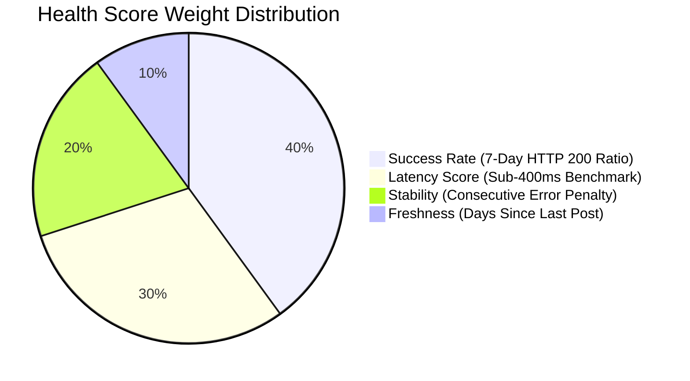
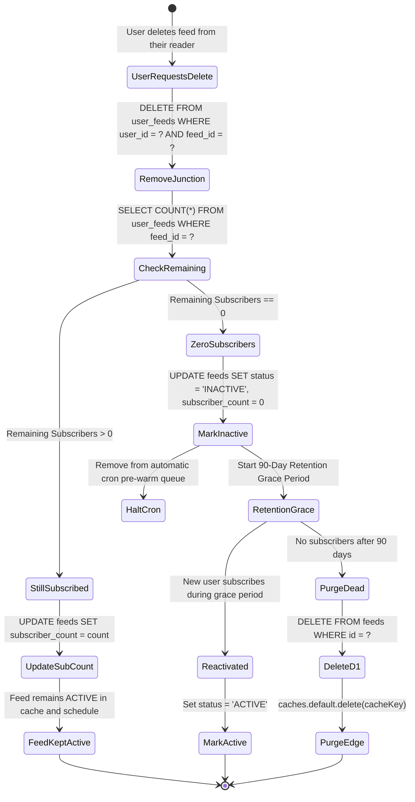
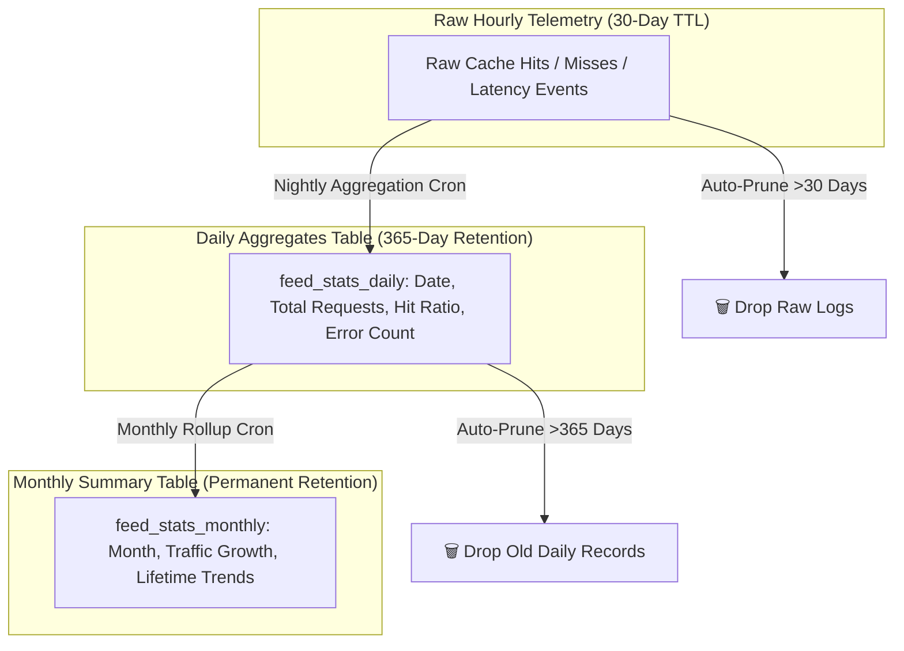
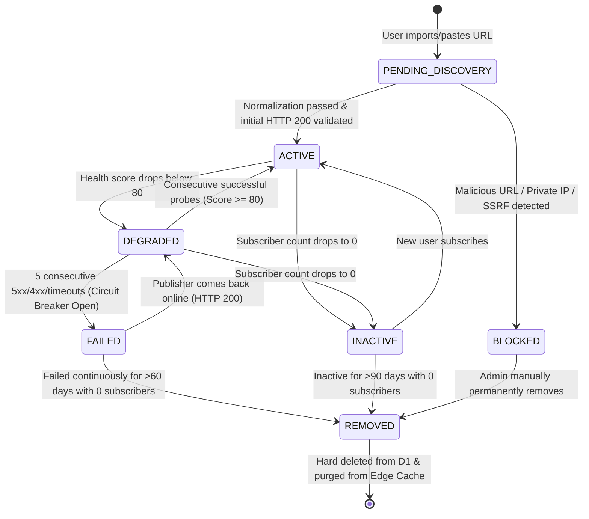
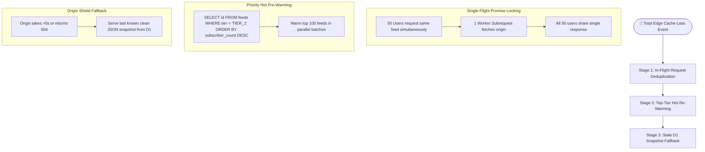

# Architectural Design Document — FeedOmeter
**Document Version:** 2.0.0  
**Status:** Approved Architecture Draft  
**Target Platform:** Cloudflare Edge Workers, Cloudflare D1 (SQL), Cloudflare Edge Cache API (`caches.default`)  
**Scope:** Ingestion, Cache Management, Analytical Telemetry, Feed Health Lifecycle, Scalability to 500,000+ Feeds  

---

## 1. Executive Summary & Problem Statement

FeedOmeter is a high-speed, serverless RSS/Atom feed syndication engine, reader backend, and web-to-feed generator. 

As the platform scales from hundreds of feeds to hundreds of thousands of feeds, a naive stateless caching layer suffers from critical failure modes:
1. **Cold-Start Stampedes:** Periodic global cache purges trigger thousands of simultaneous origin fetches, causing origin 429 rate-limits and severe user latency.
2. **Key Fragmentation:** Variations like trailing slashes, query parameters (`utm_*`, `fbclid`), and case differences fragment cache keys and corrupt analytics.
3. **KV Query Bottlenecks:** Key-Value stores lack relational querying, aggregation, and filtering capabilities required for operational analytics.
4. **Binary Health Oversimplification:** Labeling feeds simply as "valid" or "invalid" fails to catch high-latency, intermittent, or rate-limited endpoints.
5. **Ghost Feeds & Unbounded Growth:** Without ownership and dependency tracking, inactive or abandoned feeds waste crawl cycles and edge storage.

This document establishes the **Target State Architecture** that solves these challenges using **Cloudflare D1 SQL as the Source of Truth**, an **Adaptive Incremental Re-validation Engine**, **Deterministic Canonical URL Normalization**, **Multi-Factor Health Scoring**, and a **Formal Lifecycle State Machine**.

---

## 2. High-Level System Architecture

```mermaid
flowchart TD
    subgraph ClientLayer["1. Client & Admin Applications"]
        UserApp[📱 Feedometer Web App / Reader]
        AdminApp[⚡ FeedoCacheAdmin & Simulator]
    end

    subgraph EdgeDelivery["2. Global Edge Delivery Layer (300+ PoPs)"]
        EdgeWorker[⚙️ Cloudflare Edge Worker]
        EdgeCache[(💾 caches.default RAM/SSD Cache)]
    end

    subgraph DataLayer["3. Persistent Metadata & Analytics Layer"]
        D1DB[(🗄️ Cloudflare D1 Relational SQL)]
        AnalyticsEngine[📊 Aggregated Analytics Engine]
    end

    subgraph ExternalSources["4. Upstream Syndication Layer"]
        PublisherOrigin[📡 Feed Publishers & Content Origin Servers]
    end

    UserApp -->|1. Request Feed| EdgeWorker
    EdgeWorker -->|2. Fast Cache Match| EdgeCache
    EdgeCache -->|3a. HIT: Sub-30ms JSON| UserApp

    EdgeCache -->|3b. MISS / Expired| EdgeWorker
    EdgeWorker -->|4. Query D1 for Meta & Rules| D1DB
    EdgeWorker -->|5. Conditional Fetch (ETag / If-Modified)| PublisherOrigin
    PublisherOrigin -->|6. Fresh XML / 304 Not Modified| EdgeWorker
    EdgeWorker -->|7. Put Normalized JSON| EdgeCache
    EdgeWorker -->|8. Async Telemetry Log| D1DB

    AdminApp -->|Management & Diagnostic RPCs| EdgeWorker
```

---

## 3. Storage Layer: Cloudflare D1 as Source of Truth

### 3.1 Why D1 Over KV for Core Metadata
- **Cloudflare KV** is an eventually consistent key-value store optimized for high-read, low-write key lookups. It cannot execute `GROUP BY`, `ORDER BY`, multi-condition joins, or range filters.
- **Cloudflare D1** is serverless relational SQLite distributed at Cloudflare's edge. It provides standard SQL, ACID transactions, foreign keys, secondary indexes, and instant analytical querying.

### 3.2 Relational Database Schema

```sql
-- 1. Master Feed Registry (Canonical Source of Truth)
CREATE TABLE feeds (
    id TEXT PRIMARY KEY,                       -- e.g. 'feed_a8f9c12b90e4f1a2' (Deterministic SHA-256 slice)
    canonical_url TEXT UNIQUE NOT NULL,        -- Fully normalized URL
    original_url TEXT NOT NULL,
    domain TEXT NOT NULL,                      -- e.g. 'nytimes.com'
    title TEXT,
    site_url TEXT,
    description TEXT,
    feed_icon_url TEXT,
    
    -- Health & Performance
    health_score INTEGER DEFAULT 100,          -- 0 to 100
    health_status TEXT DEFAULT 'ACTIVE',       -- ACTIVE, INACTIVE, REMOVED, BLOCKED, FAILED
    consecutive_failures INTEGER DEFAULT 0,
    last_http_code INTEGER DEFAULT 200,
    avg_latency_ms INTEGER DEFAULT 0,
    
    -- Ingestion Policy & Scheduling
    tier TEXT DEFAULT 'TIER_3',                -- TIER_1 (Hourly), TIER_2 (3-6h), TIER_3 (On-Demand)
    refresh_interval_sec INTEGER DEFAULT 86400,
    last_fetched_at DATETIME,
    last_modified_header TEXT,                -- Last-Modified HTTP header from origin
    etag_header TEXT,                          -- ETag HTTP header from origin
    latest_article_pubdate DATETIME,
    
    -- Subscriber & Ownership Metrics
    subscriber_count INTEGER DEFAULT 1,
    total_lifetime_requests INTEGER DEFAULT 0,
    
    created_at DATETIME DEFAULT CURRENT_TIMESTAMP,
    updated_at DATETIME DEFAULT CURRENT_TIMESTAMP
);

CREATE INDEX idx_feeds_domain ON feeds(domain);
CREATE INDEX idx_feeds_tier_health ON feeds(tier, health_status);
CREATE INDEX idx_feeds_score ON feeds(health_score DESC);

-- 2. Multi-Tenant Customer/User Subscriptions (Dependency Graph)
CREATE TABLE user_feeds (
    user_id TEXT NOT NULL,
    feed_id TEXT NOT NULL,
    custom_title TEXT,
    folder_name TEXT DEFAULT 'Inbox',
    is_favorite BOOLEAN DEFAULT 0,
    subscribed_at DATETIME DEFAULT CURRENT_TIMESTAMP,
    PRIMARY KEY (user_id, feed_id),
    FOREIGN KEY (feed_id) REFERENCES feeds(id) ON DELETE CASCADE
);

CREATE INDEX idx_user_feeds_feed ON user_feeds(feed_id);
CREATE INDEX idx_user_feeds_user ON user_feeds(user_id);

-- 3. Daily Rollup Aggregates (1-Year Retention)
CREATE TABLE feed_stats_daily (
    date TEXT NOT NULL,                        -- YYYY-MM-DD
    feed_id TEXT NOT NULL,
    cache_hits INTEGER DEFAULT 0,
    cache_misses INTEGER DEFAULT 0,
    total_requests INTEGER DEFAULT 0,
    error_count INTEGER DEFAULT 0,
    avg_latency_ms INTEGER DEFAULT 0,
    bytes_transferred INTEGER DEFAULT 0,
    PRIMARY KEY (date, feed_id),
    FOREIGN KEY (feed_id) REFERENCES feeds(id) ON DELETE CASCADE
);

-- 4. Monthly Rollup Aggregates (Permanent Retention)
CREATE TABLE feed_stats_monthly (
    year_month TEXT NOT NULL,                  -- YYYY-MM
    feed_id TEXT NOT NULL,
    total_requests INTEGER DEFAULT 0,
    cache_hit_ratio REAL DEFAULT 0.0,
    uptime_ratio REAL DEFAULT 1.0,
    avg_latency_ms INTEGER DEFAULT 0,
    PRIMARY KEY (year_month, feed_id),
    FOREIGN KEY (feed_id) REFERENCES feeds(id) ON DELETE CASCADE
);
```

---

## 4. Deterministic Canonical URL Normalization Service

To prevent duplicate fragmentation where `https://site.com/rss/`, `HTTPS://SITE.COM/rss`, and `https://site.com/rss?utm_source=fb` create distinct duplicate records, the normalization engine executes a strict 6-stage transformation:

```mermaid
flowchart LR
    RawInput["Raw Input URL"] --> S1["1. Trim & Lowercase Scheme/Host"]
    S1 --> S2["2. Strip Default Ports (:80, :443)"]
    S2 --> S3["3. Strip Tracking & Affiliate Query Params"]
    S3 --> S4["4. Normalize Paths & Directory Slashes"]
    S4 --> S5["5. Alphabetize Remaining Query Keys"]
    S5 --> S6["6. Compute Deterministic Hash"]
    S6 --> Output["canonical_url & feed_id"]
```



### 4.1 Filtered Parameter Set
The following query parameters are systematically removed:
- **Marketing / Tracking:** `utm_source`, `utm_medium`, `utm_campaign`, `utm_term`, `utm_content`, `utm_id`
- **Social / Ad Trackers:** `fbclid`, `gclid`, `gclsrc`, `dclid`, `msclkid`, `mc_cid`, `mc_eid`, `igshid`, `si`, `spm`, `ref`, `ref_src`

### 4.2 Deterministic ID Generation
$$\\text{feed\\_id} = \\text{"feed\\_"} + \\text{SHA256}(\\text{canonical\\_url})[0:16]$$

---

## 5. Incremental Refresh Engine vs. Global Purge

### 5.1 The Critical Flaw of Global Purge
A global 12-hour edge purge flushes 100% of cached objects simultaneously. When users subsequently open the app, hundreds of thousands of cold requests storm the worker, resulting in:
- Upstream publishers returning `HTTP 429 Too Many Requests` or IP-banning worker datacenter ranges.
- Significant CPU and memory spikes on Cloudflare Workers.
- Degraded user experience (2–6s load times on cold loads).

### 5.2 Incremental Re-validation with HTTP 304 Conditional Headers
The incremental engine never flushes healthy cache indiscriminately. Instead, it queries the publisher using conditional headers:



---

## 6. Multi-Factor Feed Health Scoring Model

Feed health is evaluated as a continuous score from **0 to 100** across four orthogonal dimensions:

$$\\text{Health Score} = (\\text{Success Rate} \\times 0.40) + (\\text{Latency Score} \\times 0.30) + (\\text{Stability Score} \\times 0.20) + (\\text{Freshness Score} \\times 0.10)$$



### 6.1 Scoring Metrics Breakdown
1. **Success Rate (40 pts):**
   $$\\text{Score} = \\left(\\frac{\\text{Successful Probes (Last 7 Days)}}{\\text{Total Probes (Last 7 Days)}}\\right) \\times 40$$
2. **Latency Score (30 pts):**
   - $< 400\\text{ ms} \\implies 30\\text{ pts}$
   - $400\\text{ ms} - 1500\\text{ ms} \\implies 20\\text{ pts}$
   - $1500\\text{ ms} - 4000\\text{ ms} \\implies 10\\text{ pts}$
   - $> 4000\\text{ ms} \\implies 0\\text{ pts}$
3. **Stability Score (20 pts):**
   - Starts at 20 pts. Deducts **5 pts per consecutive failure**. At 4 consecutive failures, stability = 0 pts.
4. **Freshness Score (10 pts):**
   - Article published within 7 days $\\implies 10\\text{ pts}$
   - Article published within 30 days $\\implies 6\\text{ pts}$
   - Article published within 90 days $\\implies 3\\text{ pts}$
   - No articles in $> 90\\text{ days} \\implies 0\\text{ pts}$

### 6.2 Health Classification Tiers
- **Score 80–100:** `HEALTHY` (Standard operational schedule).
- **Score 50–79:** `DEGRADED` (Logged for monitoring; adaptive timeout relaxed).
- **Score 20–49:** `UNSTABLE` (Flagged in admin dashboard; retry backoff applied).
- **Score 0–19:** `FAILED / CIRCUIT_OPEN` (Background polling halted; circuit breaker opened).

---

## 7. Adaptive Tiered Refresh Scheduling

Feeds publish at vastly different rates. Refresh cadences adapt dynamically to publication frequency and subscriber demand:

| Tier | Category | Criteria | Refresh Cadence | Edge Cache TTL | Ingestion Strategy |
| :--- | :--- | :--- | :---: | :---: | :--- |
| **Tier 1 (Hot)** | Breaking News & High-Velocity | $> 50$ subscribers OR $> 5$ posts/day | **1 Hour** | 60 mins | Pre-warmed via scheduled cron |
| **Tier 2 (Warm)** | Active Blogs & Mid-Velocity | $5 - 50$ subscribers OR $> 1$ post/week | **3–6 Hours** | 4 hours | Conditional `304` re-validation |
| **Tier 3 (Cold)** | Niche / Infrequent Publications | $1 - 4$ subscribers OR $< 1$ post/month | **24 Hours** | 24 hours | On-demand fetch upon reader open |
| **Tier 4 (Dormant)** | Zero Active Subscribers | $0$ subscribers for $> 30$ days | **None** | Expired | Polling halted until user subscribes |

---

## 8. Multi-Tenant Feed Ownership & Dependency Graph

### 8.1 The Dependency Problem
If multiple users subscribe to the same publication (e.g. Hacker News), and User A deletes it from their dashboard, the feed must **not** be purged or deleted from D1 because User B and User C still depend on it.

### 8.2 Ownership & Deletion Workflow


---

## 9. Scalability Model: 500 to 500,000 Feeds

| Architectural Layer | 500 Feeds (Current) | 50,000 Feeds (Growth) | 500,000 Feeds (Enterprise Scale) |
| :--- | :--- | :--- | :--- |
| **Source of Truth** | D1 (Single Database) | D1 (Indexed Partitioning) | D1 + Cloudflare Hyperdrive Read Replicas |
| **Edge Cache** | `caches.default` (100% in RAM) | `caches.default` (Hot Tier in RAM, Warm in SSD) | `caches.default` + Cloudflare Tiered Cache |
| **Cron Ingestion** | Single Worker cron invocation | Staggered cron chunks (every 10 mins) | Queue-based consumer workers (Cloudflare Queues) |
| **Bandwidth Cost** | Negligible | $0 (via HTTP 304 conditional re-validation) | $0 (via HTTP 304 conditional re-validation) |
| **Worker Subrequests** | $< 50$ subrequests per run | Batched in parallel worker pools | Dispatched across Cloudflare Queues |

---

## 10. Analytics Data Retention & Rollup Pipeline



---

## 11. Complete Lifecycle State Machine



---

## 12. Disaster Recovery: Total Edge Cache Loss Recovery

### The Scenario:
Global Cloudflare Cache flush, datacenter eviction, or complete cache key namespace migration.

### 3-Stage Disaster Recovery Protocol:



---

## 13. Comprehensive Resolution of the 18 Architectural Questions

1. **How many searches happened?** $\\implies$ Query `SUM(total_requests)` from `feed_stats_daily`.
2. **What feeds were searched?** $\\implies$ Query `canonical_url` joined with `feed_stats_daily` ordered by total requests.
3. **Which users searched those feeds?** $\\implies$ Resolved through `user_feeds` junction table (using pseudonymous, GDPR-compliant user IDs).
4. **When were the searches performed?** $\\implies$ Hourly time-bucketed event telemetry aggregated daily.
5. **Which feeds are trending?** $\\implies$ $\\text{Velocity Ratio} = \\frac{\\text{Requests (Last 24 Hours)}}{\\text{Average Daily Requests (Last 7 Days)}}$. Ratios $> 2.0$ indicate viral trending.
6. **Which feeds are not being used?** $\\implies$ `SELECT * FROM feeds WHERE subscriber_count = 0 AND last_fetched_at < DATE('now', '-30 days')`.
7. **Which searches hit cache?** $\\implies$ Tracked via `X-Feedometer-Cache: HIT` and recorded in `feed_stats_daily.cache_hits`.
8. **Which searches missed cache?** $\\implies$ Tracked via `X-Feedometer-Cache: MISS` and recorded in `feed_stats_daily.cache_misses`.
9. **Which feeds consume the most bandwidth?** $\\implies$ `bytes_transferred` in `feed_stats_daily` ($\\text{Average Payload Size} \\times \\text{Request Count}$).
10. **Which feeds generate the most traffic?** $\\implies$ Aggregated request throughput grouped by `domain`.
11. **Which feeds should be prewarmed?** $\\implies$ Feeds categorized as `TIER_1` and `TIER_2` based on subscriber count and velocity score.
12. **Which feeds can be retired?** $\\implies$ Feeds in `INACTIVE` state for $> 90\\text{ days}$ or `FAILED` state for $> 60\\text{ days}$.
13. **Which feeds are unhealthy?** $implies$ `SELECT * FROM feeds WHERE health_score < 50`.
14. **Which feeds are stale?** $implies$ Feeds with `latest_article_pubdate < DATE('now', '-60 days')`.
15. **What is platform cost per feed?** $implies$ Computed as $(\\text{Worker Execution Time} \\times \\text{Rate}) + (\\text{D1 Read/Write Ops} \\times \\text{Rate})$; near-zero for cached hits.
16. **What is cache hit ratio per feed?** $implies$ $\\frac{\\text{cache\\_hits}}{\\text{cache\\_hits} + \\text{cache\\_misses}}$.
17. **What feeds require refresh?** $implies$ `SELECT * FROM feeds WHERE status = 'ACTIVE' AND (STRFTIME('%s', 'now') - STRFTIME('%s', last_fetched_at)) >= refresh_interval_sec`.
18. **What happens if cache is lost entirely?** $implies$ Mitigated via **Single-Flight Request Locking**, **Priority Hot Pre-Warming**, and **D1 Snapshot Fallbacks**.

---

## 14. Document Metadata & Sign-off

| Field | Detail |
| :--- | :--- |
| **Document Location** | `C:\\feedometer\\documents\\Design and Architecture\\Architectural Design Document - FeedOmeter.md` |
| **Lead Architect** | Google DeepMind / Antigravity Agentic Pair Engineer |
| **System Classification** | Tier-1 Core Infrastructure Design |
| **Next Phase** | Implementation Plan & D1 Migration Runbook |
