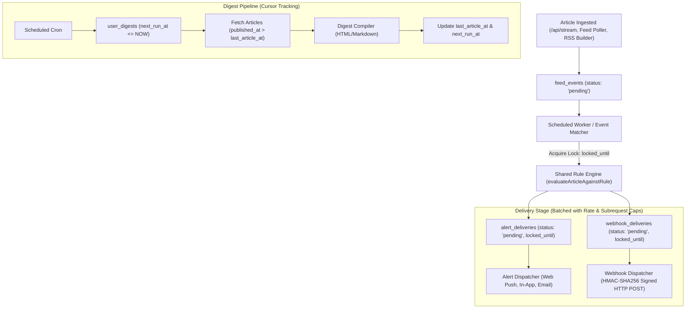

# Revised Phase 5 Implementation Plan: Event-Driven Automation Engine
## (Alerts, Webhooks & Digests with Distributed Locking & Cursor Tracking)

---

## 1. Architectural Blueprint



---

## 2. Refined D1 Database Schema (`schema_phase5_automation.sql`)

### A. Generic Feed Event Queue (with Lifecycle & Locking)
```sql
CREATE TABLE IF NOT EXISTS feed_events (
  id TEXT PRIMARY KEY,
  article_id TEXT NOT NULL,
  source_id TEXT NOT NULL,
  event_type TEXT DEFAULT 'ARTICLE_INGESTED',
  status TEXT DEFAULT 'pending' CHECK(status IN ('pending', 'processing', 'completed', 'failed')),
  locked_until INTEGER DEFAULT 0,
  retry_count INTEGER DEFAULT 0,
  error_message TEXT,
  created_at INTEGER NOT NULL,
  processed_at INTEGER,
  FOREIGN KEY (article_id) REFERENCES articles(id) ON DELETE CASCADE,
  FOREIGN KEY (source_id) REFERENCES sources(id) ON DELETE CASCADE
);

CREATE INDEX IF NOT EXISTS idx_feed_events_queue 
ON feed_events(status, locked_until, created_at);
```

### B. User Alerts & Outbox Queue (with Distributed Lock)
```sql
CREATE TABLE IF NOT EXISTS user_alerts (
  id TEXT PRIMARY KEY,
  user_id TEXT NOT NULL,
  name TEXT NOT NULL,
  alert_type TEXT DEFAULT 'keyword' CHECK(alert_type IN ('keyword', 'collection', 'source', 'saved_search')),
  config_json TEXT NOT NULL,
  delivery_channels TEXT NOT NULL, -- JSON array: ["in_app", "push", "email"]
  is_active INTEGER DEFAULT 1 CHECK(is_active IN (0, 1)),
  created_at INTEGER NOT NULL,
  updated_at INTEGER,
  FOREIGN KEY (user_id) REFERENCES users(id) ON DELETE CASCADE
);

CREATE TABLE IF NOT EXISTS alert_deliveries (
  id TEXT PRIMARY KEY,
  alert_id TEXT NOT NULL,
  article_id TEXT NOT NULL,
  channel TEXT NOT NULL CHECK(channel IN ('in_app', 'push', 'email', 'telegram')),
  status TEXT DEFAULT 'pending' CHECK(status IN ('pending', 'processing', 'sent', 'failed')),
  attempt_count INTEGER DEFAULT 0,
  locked_until INTEGER DEFAULT 0,
  sent_at INTEGER,
  error_message TEXT,
  created_at INTEGER NOT NULL,
  FOREIGN KEY (alert_id) REFERENCES user_alerts(id) ON DELETE CASCADE,
  FOREIGN KEY (article_id) REFERENCES articles(id) ON DELETE CASCADE
);

CREATE INDEX IF NOT EXISTS idx_alerts_user ON user_alerts(user_id, is_active);
CREATE INDEX IF NOT EXISTS idx_alert_delivery_queue ON alert_deliveries(status, locked_until, created_at);
```

### C. Webhooks & Outbox Queue (with HMAC & Retries)
```sql
CREATE TABLE IF NOT EXISTS user_webhooks (
  id TEXT PRIMARY KEY,
  user_id TEXT NOT NULL,
  name TEXT NOT NULL,
  target_url TEXT NOT NULL,
  secret_key TEXT NOT NULL,
  config_json TEXT, -- Optional filter criteria
  is_active INTEGER DEFAULT 1 CHECK(is_active IN (0, 1)),
  created_at INTEGER NOT NULL,
  FOREIGN KEY (user_id) REFERENCES users(id) ON DELETE CASCADE
);

CREATE TABLE IF NOT EXISTS webhook_deliveries (
  id TEXT PRIMARY KEY,
  webhook_id TEXT NOT NULL,
  article_id TEXT NOT NULL,
  payload_json TEXT NOT NULL,
  status TEXT DEFAULT 'pending' CHECK(status IN ('pending', 'processing', 'delivered', 'failed')),
  attempt_count INTEGER DEFAULT 0,
  locked_until INTEGER DEFAULT 0,
  response_code INTEGER,
  response_body TEXT,
  duration_ms INTEGER,
  delivered_at INTEGER,
  created_at INTEGER NOT NULL,
  FOREIGN KEY (webhook_id) REFERENCES user_webhooks(id) ON DELETE CASCADE,
  FOREIGN KEY (article_id) REFERENCES articles(id) ON DELETE CASCADE
);

CREATE INDEX IF NOT EXISTS idx_webhooks_user ON user_webhooks(user_id, is_active);
CREATE INDEX IF NOT EXISTS idx_webhook_delivery_queue ON webhook_deliveries(status, locked_until, created_at);
```

### D. Web Push Subscriptions
```sql
CREATE TABLE IF NOT EXISTS user_push_subscriptions (
  id TEXT PRIMARY KEY,
  user_id TEXT NOT NULL,
  endpoint TEXT NOT NULL,
  p256dh TEXT NOT NULL,
  auth_key TEXT NOT NULL,
  user_agent TEXT,
  created_at INTEGER NOT NULL,
  FOREIGN KEY (user_id) REFERENCES users(id) ON DELETE CASCADE
);

CREATE INDEX IF NOT EXISTS idx_push_user ON user_push_subscriptions(user_id);
```

### E. Scheduled Digests (with High-Water Mark Cursor)
```sql
CREATE TABLE IF NOT EXISTS user_digests (
  id TEXT PRIMARY KEY,
  user_id TEXT NOT NULL,
  name TEXT NOT NULL,
  schedule_type TEXT NOT NULL CHECK(schedule_type IN ('daily', 'weekly')),
  delivery_channel TEXT DEFAULT 'email' CHECK(delivery_channel IN ('email', 'in_app')),
  collection_ids TEXT, -- JSON array of folder/collection IDs
  config_json TEXT,    -- Optional additional filters
  last_article_at INTEGER DEFAULT 0, -- High-water mark cursor
  last_run_at INTEGER,
  next_run_at INTEGER NOT NULL,
  is_active INTEGER DEFAULT 1 CHECK(is_active IN (0, 1)),
  created_at INTEGER NOT NULL,
  FOREIGN KEY (user_id) REFERENCES users(id) ON DELETE CASCADE
);

CREATE TABLE IF NOT EXISTS digest_runs (
  id TEXT PRIMARY KEY,
  digest_id TEXT NOT NULL,
  article_count INTEGER DEFAULT 0,
  status TEXT DEFAULT 'completed',
  sent_to TEXT,
  started_at INTEGER NOT NULL,
  completed_at INTEGER NOT NULL,
  FOREIGN KEY (digest_id) REFERENCES user_digests(id) ON DELETE CASCADE
);

CREATE INDEX IF NOT EXISTS idx_digest_schedule ON user_digests(is_active, next_run_at);
```

---

## 3. Core Engine Modules (`workers/`)

### 1. `workers/services/rule-engine.js` (Universal Single-Point Matcher)
- Function: `evaluateArticleAgainstRule(article, ruleConfig)`
  - Accepts article `{ title, summary, content, url, source_id, category, author }`.
  - Evaluates:
    - Keywords / Phrases (`includeKeywords`, `excludeKeywords`)
    - Boolean Expressions (`boolean-parser.js`)
    - Source & Domain filters (`sourceIds`, `includeDomains`, `excludeDomains`)
    - Content Quality (HTTPS, images, length, freshness)
  - Returns: `{ matched: boolean, matchedRules: string[] }`.

### 2. `workers/services/event-matcher.js` (Locking & Batch Matching)
- Atomically claims pending events using distributed lease:
  ```sql
  UPDATE feed_events 
  SET status = 'processing', locked_until = ? (NOW + 60s)
  WHERE status = 'pending' OR (status = 'processing' AND locked_until < ?)
  LIMIT 25;
  ```
- Evaluates claimed articles against active `user_alerts` and `user_webhooks`.
- Bulk-inserts pending records into `alert_deliveries` and `webhook_deliveries`.
- Sets `status = 'completed'` on `feed_events`.

### 3. `workers/services/webhook-dispatcher.js` (HMAC & Subrequest Batches)
- Atomically claims up to 15 pending webhook deliveries.
- Calculates `X-Feedometer-Signature: HMAC_SHA256(secret_key, payload)`.
- Dispatches HTTP `POST` requests in parallel (`Promise.allSettled`).
- If successful: records `status = 'delivered'`, `response_code`, latency.
- If failed (timeout / 5xx): increments `attempt_count`. If `< 3`, releases lock for retry; if `>= 3`, marks `status = 'failed'`.

### 4. `workers/services/alert-dispatcher.js` (Multi-Channel Dispatcher)
- Claims up to 20 pending alert deliveries.
- Dispatches based on channel:
  - `in_app`: creates/updates notification badge and unread inbox entries.
  - `push`: formats Web Push payload and signs via VAPID standard.
  - `email`: triggers transactional mail worker/API.

### 5. `workers/services/digest-generator.js` (Cursor-Driven Compiler)
- Fetches due digests: `WHERE is_active = 1 AND next_run_at <= ? ORDER BY next_run_at LIMIT 10`.
- Fast query using cursor:
  ```sql
  SELECT * FROM articles 
  WHERE published_at > user_digest.last_article_at 
    AND (source_id IN (...) OR ...)
  ORDER BY published_at DESC LIMIT 50;
  ```
- Compiles responsive HTML template and markdown summary.
- Updates `last_article_at = MAX(article.published_at)` and calculates next `next_run_at` (e.g. +24h or +7d).

---

## 4. Cloudflare Worker Consolidated Cron Integration

In `workers/feedometer-worker.js`:
```javascript
export default {
  async fetch(request, env, ctx) {
    // Standard REST API routing
  },
  
  async scheduled(event, env, ctx) {
    ctx.waitUntil((async () => {
      const now = Date.now();
      // Step 1: Process Event Ingestion Queue (Lock & Match)
      await processFeedEventQueue(env, now);
      
      // Step 2: Dispatch Pending Webhook Deliveries (Max 15 subrequests)
      await dispatchPendingWebhooks(env, now);
      
      // Step 3: Dispatch Pending Alert Deliveries (Max 20 subrequests)
      await dispatchPendingAlerts(env, now);
      
      // Step 4: Run Due Digests
      await processDueDigests(env, now);
    })());
  }
};
```

---

## 5. API Endpoints & UI Workspace

### REST API Endpoints:
- **Alerts:** `GET/POST /api/alerts`, `DELETE /api/alerts/:id`, `POST /api/alerts/test`
- **Webhooks:** `GET/POST /api/webhooks`, `DELETE /api/webhooks/:id`, `POST /api/webhooks/:id/test`, `GET /api/webhooks/:id/logs`
- **Digests:** `GET/POST /api/digests`, `DELETE /api/digests/:id`, `POST /api/digests/preview`
- **Push:** `POST /api/push/subscribe`, `POST /api/push/test`

### UI Workspace:
- Dedicated **`automation.html`** with 3 unified tabs:
  1. *Rule & Keyword Alerts Studio* (live test against recent feed items)
  2. *Webhooks Manager* (secret key generator, instant test ping, delivery log viewer)
  3. *Digest Builder* (daily/weekly scheduler, source picker, responsive live HTML preview)

---

## 6. Verification Plan

### Automated Test Suite: `test_automation_units.mjs`
1. **Rule Engine Test:** Unit tests validating `evaluateArticleAgainstRule` across complex AND/OR/NOT, domain whitelists, and keyword exclusions.
2. **Lease/Lock Test:** Simulates 2 concurrent worker nodes to verify `locked_until` prevents duplicate event consumption.
3. **Webhook HMAC Test:** Verifies signature generation and mock HTTP POST delivery headers.
4. **Digest Cursor Test:** Verifies that `last_article_at` correctly advances and prevents duplicate article inclusion in subsequent runs.
5. **Retry & Failure Handling Test:** Verifies that 3 consecutive failed deliveries transitions item to `status = 'failed'` without crashing the worker.
