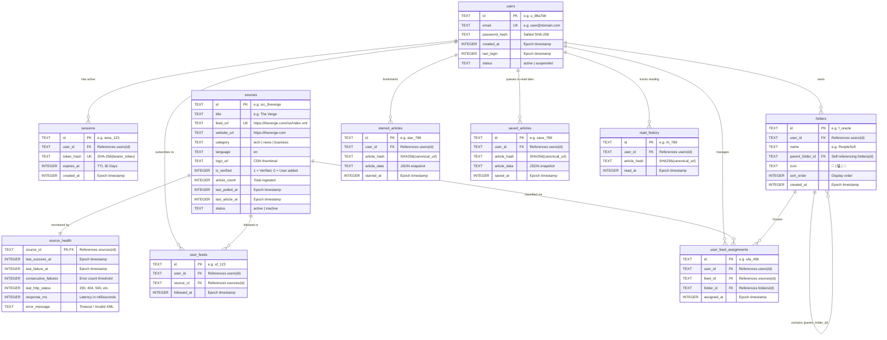

# FEEDOMETER 2.1 — DATABASE ER SCHEMA & DATA ARCHITECTURE
## Entity-Relationship Diagrams, Relational D1 Data Models & Article Identity Specification

**Document Title:** ER Schema Document  
**Project Phase:** Phase 2 — Personal Reader Fundamentals  
**Database Engine:** Cloudflare D1 (Relational SQLite at the Edge)  
**Version:** 1.0 (Finalized Production Schema)  
**Date:** September 18, 2026  
**Target Directory:** `C:\feedometer_next_phase\documents\Feedometer 2,1\Phase II`  

---

## 1. Master Entity-Relationship (ER) Diagram



---

## 2. Table & Entity Dictionary

| Table Name | Primary / Foreign Keys | Purpose & Description |
| :--- | :--- | :--- |
| **`users`** | PK: `id`<br>UK: `email` | User account profiles, salted SHA-256 password hashes, creation and last login timestamps. |
| **`sessions`** | PK: `id`<br>FK: `user_id` $\to$ `users(id)`<br>UK: `token_hash` | Active bearer authentication tokens with 30-day expiration TTL. |
| **`sources`** | PK: `id`<br>UK: `feed_url` | Master feed catalog containing system-curated and user-added verified feeds with discovery metadata. |
| **`source_health`** | PK, FK: `source_id` $\to$ `sources(id)` | Automated health telemetry: consecutive failures, last HTTP status code, latency response_ms, error messages. |
| **`user_feeds`** | PK: `id`<br>FK: `user_id`, `source_id`<br>UK: `(`user_id`, `source_id`)` | Decoupled following layer. Captures which feeds a user subscribes to for their Daily Stream. |
| **`folders`** | PK: `id`<br>FK: `user_id`, `parent_folder_id` $\to$ `folders(id)` | Hierarchical taxonomy tree. Supports infinite recursive nesting via self-referencing `parent_folder_id`. |
| **`user_feed_assignments`** | PK: `id`<br>FK: `user_id`, `feed_id`, `folder_id`<br>UK: `(`user_id`, `feed_id`, `folder_id`)` | Decoupled classification layer. Maps feeds to specific nested folders for domain-specific streams. |
| **`starred_articles`** | PK: `id`<br>FK: `user_id`<br>UK: `(`user_id`, `article_hash`)` | Persistent user bookmarked articles keyed cryptographically by `article_hash`. |
| **`saved_articles`** | PK: `id`<br>FK: `user_id`<br>UK: `(`user_id`, `article_hash`)` | Read Later queue storing saved articles keyed cryptographically by `article_hash`. |
| **`read_history`** | PK: `id`<br>FK: `user_id`<br>UK: `(`user_id`, `article_hash`)` | Tracks read article states for visual card dimming and unread badge computation. |

---

## 3. Production D1 SQL Implementation Script

```sql
-- 1. Users
CREATE TABLE IF NOT EXISTS users (
  id TEXT PRIMARY KEY,
  email TEXT UNIQUE NOT NULL,
  password_hash TEXT NOT NULL,
  created_at INTEGER NOT NULL,
  last_login INTEGER,
  status TEXT DEFAULT 'active'
);

-- 2. Sessions
CREATE TABLE IF NOT EXISTS sessions (
  id TEXT PRIMARY KEY,
  user_id TEXT NOT NULL,
  token_hash TEXT UNIQUE NOT NULL,
  expires_at INTEGER NOT NULL,
  created_at INTEGER NOT NULL,
  FOREIGN KEY (user_id) REFERENCES users(id) ON DELETE CASCADE
);

-- 3. Sources
CREATE TABLE IF NOT EXISTS sources (
  id TEXT PRIMARY KEY,
  title TEXT NOT NULL,
  feed_url TEXT UNIQUE NOT NULL,
  website_url TEXT,
  category TEXT DEFAULT 'general',
  language TEXT DEFAULT 'en',
  logo_url TEXT,
  is_verified INTEGER DEFAULT 0,
  article_count INTEGER DEFAULT 0,
  last_polled_at INTEGER,
  last_article_at INTEGER,
  status TEXT DEFAULT 'active'
);

-- 4. Source Health & Telemetry
CREATE TABLE IF NOT EXISTS source_health (
  source_id TEXT PRIMARY KEY,
  last_success_at INTEGER,
  last_failure_at INTEGER,
  consecutive_failures INTEGER DEFAULT 0,
  last_http_status INTEGER,
  response_ms INTEGER,
  error_message TEXT,
  FOREIGN KEY (source_id) REFERENCES sources(id) ON DELETE CASCADE
);

-- 5. User Feeds (Following Layer)
CREATE TABLE IF NOT EXISTS user_feeds (
  id TEXT PRIMARY KEY,
  user_id TEXT NOT NULL,
  source_id TEXT NOT NULL,
  followed_at INTEGER NOT NULL,
  UNIQUE(user_id, source_id),
  FOREIGN KEY (user_id) REFERENCES users(id) ON DELETE CASCADE,
  FOREIGN KEY (source_id) REFERENCES sources(id) ON DELETE CASCADE
);

-- 6. Hierarchical Folders
CREATE TABLE IF NOT EXISTS folders (
  id TEXT PRIMARY KEY,
  user_id TEXT NOT NULL,
  name TEXT NOT NULL,
  parent_folder_id TEXT,
  icon TEXT DEFAULT '📁',
  sort_order INTEGER DEFAULT 0,
  created_at INTEGER NOT NULL,
  FOREIGN KEY (user_id) REFERENCES users(id) ON DELETE CASCADE,
  FOREIGN KEY (parent_folder_id) REFERENCES folders(id) ON DELETE CASCADE
);

-- 7. User Feed Assignments (Classification Layer)
CREATE TABLE IF NOT EXISTS user_feed_assignments (
  id TEXT PRIMARY KEY,
  user_id TEXT NOT NULL,
  feed_id TEXT NOT NULL,
  folder_id TEXT NOT NULL,
  assigned_at INTEGER NOT NULL,
  UNIQUE(user_id, feed_id, folder_id),
  FOREIGN KEY (user_id) REFERENCES users(id) ON DELETE CASCADE,
  FOREIGN KEY (feed_id) REFERENCES sources(id) ON DELETE CASCADE,
  FOREIGN KEY (folder_id) REFERENCES folders(id) ON DELETE CASCADE
);

-- 8. Starred Articles
CREATE TABLE IF NOT EXISTS starred_articles (
  id TEXT PRIMARY KEY,
  user_id TEXT NOT NULL,
  article_hash TEXT NOT NULL,
  article_data TEXT NOT NULL,
  starred_at INTEGER NOT NULL,
  UNIQUE(user_id, article_hash),
  FOREIGN KEY (user_id) REFERENCES users(id) ON DELETE CASCADE
);

-- 9. Saved / Read Later Articles
CREATE TABLE IF NOT EXISTS saved_articles (
  id TEXT PRIMARY KEY,
  user_id TEXT NOT NULL,
  article_hash TEXT NOT NULL,
  article_data TEXT NOT NULL,
  saved_at INTEGER NOT NULL,
  UNIQUE(user_id, article_hash),
  FOREIGN KEY (user_id) REFERENCES users(id) ON DELETE CASCADE
);

-- 10. Reading History Timeline
CREATE TABLE IF NOT EXISTS read_history (
  id TEXT PRIMARY KEY,
  user_id TEXT NOT NULL,
  article_hash TEXT NOT NULL,
  read_at INTEGER NOT NULL,
  UNIQUE(user_id, article_hash),
  FOREIGN KEY (user_id) REFERENCES users(id) ON DELETE CASCADE
);

-- High-Speed Covering Indexes
CREATE INDEX IF NOT EXISTS idx_sessions_token ON sessions(token_hash);
CREATE INDEX IF NOT EXISTS idx_user_feeds_user ON user_feeds(user_id);
CREATE INDEX IF NOT EXISTS idx_folders_user_parent ON folders(user_id, parent_folder_id);
CREATE INDEX IF NOT EXISTS idx_assignments_user_folder ON user_feed_assignments(user_id, folder_id);
CREATE INDEX IF NOT EXISTS idx_assignments_feed ON user_feed_assignments(feed_id);
CREATE INDEX IF NOT EXISTS idx_starred_user ON starred_articles(user_id);
CREATE INDEX IF NOT EXISTS idx_saved_user ON saved_articles(user_id);
CREATE INDEX IF NOT EXISTS idx_history_user ON read_history(user_id);
CREATE INDEX IF NOT EXISTS idx_source_health_failures ON source_health(consecutive_failures);
```

---
*Document compiled and archived for FeedOmeter 2.1 Engineering Documentation.*
