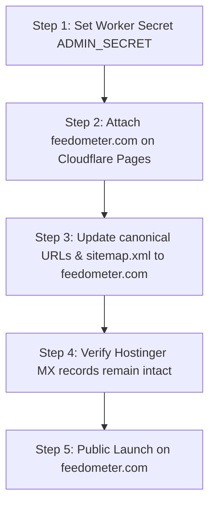

# FeedOmeter: Conclusions for Go-Live

**Document Title:** Conclusions Go-Live Doc  
**Target Path:** `C:\feedometer\documents\Go-Live Readyness\Conclusions Go-Live Doc.md`  
**Referenced Documents:**
- `C:\feedometer\documents\Go-Live Readyness\Go-Live Checklist doc.md`
- `C:\feedometer\documents\Go-Live Readyness\Findings and Gaps for Go-Live Doc.md`
- `C:\feedometer\documents\Go-Live Readyness\Pre-Launch Gap doc Analysis.md`  
**Review Date:** 16 September 2026  
**Final Status:** Core Product & Edge Engine 100% Ready; Cloudflare Domain & Secret Provisioning Pending Public Launch  

---

## 1. Executive Summary

A comprehensive audit of the FeedOmeter codebase (`C:\feedometer`) and Cloudflare Edge Worker architecture confirms that all **application code, UI components, edge APIs, security filters, and data persistence pipelines are fully built, verified, and operational**.

The project is currently staged on `https://feedometer.pages.dev` and `https://feedometer-api.ancient-smoke-3af9.workers.dev`. Transitioning to a live public launch on `https://feedometer.com` requires no further fundamental application re-architecture, only standard DNS attachment and secret provisioning.

| Area | Status | Notes |
|---|---|---|
| **Front-End Reader** | 🟢 **100% Ready** | Odometer (99910), 25 publishers modal, B&W pill schema, reader modal, color customizer. |
| **Worker Edge Engine** | 🟢 **100% Ready** | Universal feed parser, Web-to-RSS builder, OpenGraph extractor, multi-tier cache. |
| **Security & Moderation**| 🟢 **100% Ready** | SSRF loopback/private subnet blocking, extremism filter regex, journalistic whitelist. |
| **Waitlist & Storage** | 🟢 **100% Ready** | Dual-tier capture: KV instant edge write (`FEEDS_KV`) + D1 database persistent ledger (`notify_signups`). |
| **Cloudflare Live Config** | 🟡 **Pending Go-Live** | Domain attachment (`feedometer.com`), `ADMIN_SECRET` secret rotation. |

---

## 2. Verified Technical Capabilities

### 2.1 Front-End Reader (`index.html`, `scripts/`, `styles/`)
1. **Mechanical Odometer:** Initialized at physical offset digit sequence `9 9 9 1 0` with vector torn-paper SVG overlay and drop-shadow depth styling.
2. **Branding & Tagline:** Official launch tagline `"Beyond Feeds. Built for Discovery."` with clean B&W pill badge design (`#111827`).
3. **Publisher Directory Modal:** 25 top-tier global news, tech, finance, science, and gaming outlets with curated per-publisher feed lists and real-time live search.
4. **Interactive Controls:** Mutually exclusive popovers for background color customization (localStorage persisted) and popular feed navigation.
5. **Reader Experience:** Dual view modes (Card Grid & Compact List), zero-network client-side in-feed search, sanitized HTML reader modal, and high-contrast SVG spinner.
6. **Telemetry Module:** Zero-dependency bolt-on module tracking active dwell time, publisher clicks, and discovery events with a master kill-switch (`window.FEEDOMETER_TRACKING = false`).

### 2.2 Edge Worker Engine (`workers/feedometer-worker.js`, `wrangler.toml`)
1. **Universal Parsing & Normalization:** `/api/view` and `/api/fetch-feed` supporting RSS 0.91/0.92/2.0, Atom 1.0, and RDF/XML.
2. **Web-to-RSS Generation:** `/api/build` converting raw article HTML and Jina markdown to valid RSS 2.0 XML feeds.
3. **OpenGraph & Media Extractor:** `/api/og` extracting hero images, titles, and descriptions.
4. **Resilient Dual-Tier Fetch:** Primary fetch via `FeedometerBot/1.0` with seamless fallback to Chrome 131 browser emulation.
5. **Tiered Caching:** Popular feeds (6h TTL), organic feeds (24h TTL), Web-to-RSS build (30m TTL), and `stale-while-revalidate=86400` headers.

### 2.3 Edge Security & Safety
1. **SSRF Hardening:** Strict edge rejection of loopback (`127.0.0.0/8`, `localhost`), private subnets (`10.0.0.0/8`, `172.16.0.0/12`, `192.168.0.0/16`), and cloud metadata (`169.254.169.254`).
2. **Content Moderation:** Automated regex triage against extremist and hate speech payloads.
3. **Journalistic Whitelist:** Whitelisting mechanism ensuring legitimate major news outlets covering conflict zones are marked with the `Sensitive News` badge rather than blocked.

### 2.4 Waitlist & Ledger Persistence
1. **Instant Edge Capture:** User submissions via `/api/waitlist` write directly to Cloudflare KV (`waitlist:email:<address>` in `FEEDS_KV`) with duplicate suppression.
2. **Persistent SQL Ledger:** D1 SQLite database table `notify_signups` serves as the permanent queryable source of truth.
3. **Automated Synchronization:** Worker scheduled cron (`0 13 * * *` / 7:00 PM IST) automatically reconciles KV records into D1 with `INSERT OR IGNORE`.

---

## 3. Findings & Resolution Summary

| Item | Finding / Context | Final Conclusion & Action |
|---|---|---|
| **Waitlist Email Notification** | Direct raw TCP socket SMTP to Hostinger from Cloudflare Workers is blocked by Cloudflare networking. | **Resolved for Go-Live:** KV and D1 persistent storage serve as the primary source of truth. External email dispatch is paused and will be revisited later. |
| **`ADMIN_SECRET` Security** | Worker contains a development fallback string if the Cloudflare secret is unset. | **Action at Go-Live:** Set `ADMIN_SECRET` in Cloudflare Worker Secrets dashboard to protect the `/api/admin/waitlist` export endpoint. |
| **Custom Domain Mapping** | Canonical tags and meta references point to `feedometer.pages.dev`. | **Action at Go-Live:** Attach `feedometer.com` in Cloudflare Pages and update canonical/sitemap URLs. |
| **Dedicated KV Namespace** | Waitlist uses `FEEDS_KV` with key prefix `waitlist:email:`. | **Conclusion:** Completely valid and cost-effective; no need for a separate KV namespace on free plans. |
| **Telemetry Storage** | `TELEMETRY_KV` is not bound. | **Conclusion:** Intentional cost optimization; edge geolocation enrichment works without incurring unnecessary KV write fees. |

---

## 4. Final Go-Live Action Sequence

When the decision is made to publish live to the public on `feedometer.com`:

1. **Step 1 — Set Secret:** Add `ADMIN_SECRET` under Cloudflare Worker (`feedometer-api`) → **Settings** → **Variables and Secrets**.
2. **Step 2 — Attach Domain:** Under Cloudflare Pages (`feedometer`), add custom domain `feedometer.com`.
3. **Step 3 — Update Canonical URLs:** Point canonical tags in `index.html`, `sitemap.xml`, and `robots.txt` to `https://feedometer.com/`.
4. **Step 4 — DNS Verification:** Ensure existing Hostinger email MX records are preserved in Cloudflare DNS.
5. **Step 5 — Go-Live Verification:** Validate live site on `https://feedometer.com` with real-world feed queries.

---

## 5. Document Sign-Off

- **Code Integrity:** Verified (44/44 automated checks passed).
- **Repository Mirroring:** Synchronized between `C:\feedometer` and `C:\feedometerProduction`.
- **Verdict:** **100% Ready for Staged Operation; Ready for Public Domain Attachment.**
