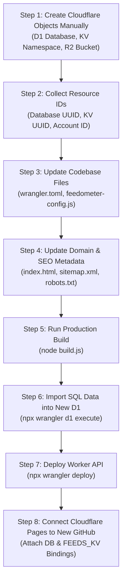

# FeedOmeter: Manual Cloudflare & GitHub Environment Migration Guide

**Document Title:** Steps for Manual Migration Doc  
**Version:** 1.0  
**Target Path:** `C:\feedometer\documents\MIgration from one cloudfalre to another\steps for manual migration doc.md`  
**Purpose:** End-to-end runbook for migrating FeedOmeter to a new Cloudflare account and new GitHub repository when resources (D1, KV, Workers, R2) are created manually.

---

## 1. Executive Sequence Flow



---

## 2. Step 1: Manual Creation in Cloudflare Dashboard

Log into your new Cloudflare account and manually create the following resources:

| # | Cloudflare Resource | Where to Create in Dashboard | Name to Set | What to Copy / Note Down |
| :-: | :--- | :--- | :--- | :--- |
| **1.1** | **D1 Database** | **Storage & Databases** $\to$ **D1 SQL Database** $\to$ **Create database** | `feedometer-db` | **Database ID (UUID)** *(e.g., `b116c5d0-1ad8-4476-a8d3-694cb4eec735`)* |
| **1.2** | **KV Namespace** | **Storage & Databases** $\to$ **KV** $\to$ **Create namespace** | `FEEDS_KV` | **Namespace ID** *(e.g., `99fdc90255f0436993b8b4afa44970b3`)* |
| **1.3** | **R2 Bucket** *(Optional)* | **Storage & Databases** $\to$ **R2** $\to$ **Create bucket** | `feedometer-backups` | Bucket name |
| **1.4** | **Account Details** | Right sidebar under **Account details** | — | **Account ID** *(32-character string)* |

---

## 3. Step 2: Codebase Files to Update (In Exact Sequence)

### File 1: `wrangler.toml` *(Infrastructure & Binding Mappings)*
* **File Path:** `C:\feedometer\wrangler.toml`
* **Changes Needed:**
  1. `database_id`: Replace with the new D1 Database UUID from Step 1.1.
  2. `id` under `[[kv_namespaces]]`: Replace with the new KV Namespace ID from Step 1.2.
  3. `WORKER_PUBLIC_URL`: Set to the new Worker domain (e.g., `https://feedometer-api.<new-subdomain>.workers.dev`).
  4. `ADMIN_NOTIFY_EMAIL`: Set to your administrative email.

```toml
# Example Configuration Snippet
name = "feedometer-api"
main = "workers/feedometer-worker.js"
compatibility_date = "2024-09-01"

[vars]
ENVIRONMENT = "production"
WORKER_PUBLIC_URL = "https://feedometer-api.newsubdomain.workers.dev"
ADMIN_NOTIFY_EMAIL = "admin@newdomain.com"

[[d1_databases]]
binding = "DB"
database_name = "feedometer-db"
database_id = "PASTE_NEW_D1_DATABASE_UUID_HERE"

[[kv_namespaces]]
binding = "FEEDS_KV"
id = "PASTE_NEW_KV_NAMESPACE_ID_HERE"
```

---

### File 2: `scripts/feedometer-config.js` *(Frontend Worker Endpoint)*
* **File Path:** `C:\feedometer\scripts\feedometer-config.js`
* **Changes Needed:**
  * Update line 9 `PRODUCTION_API` to point to the new deployed Worker URL:
```javascript
// Line 9 in scripts/feedometer-config.js
var PRODUCTION_API = 'https://feedometer-api.newsubdomain.workers.dev';
```

---

### File 3: `index.html` *(Canonical Tags & Schema.org Metadata)*
* **File Path:** `C:\feedometer\index.html`
* **Changes Needed** *(Only if using a new domain / brand name)*:
  * **Line 13 (Canonical Link):** `<link rel="canonical" href="https://www.newdomain.com/">`
  * **Line 17 (OpenGraph URL):** `<meta property="og:url" content="https://www.newdomain.com/">`
  * **Line 48 (JSON-LD WebApplication URL):** `"url": "https://www.newdomain.com/"`
  * Update `<title>` and OpenGraph description if renaming the project.

---

### File 4: `sitemap.xml` & `robots.txt` *(Search Engine Discovery)*
* **File Paths:** `C:\feedometer\sitemap.xml` & `C:\feedometer\robots.txt`
* **Changes Needed** *(Only if using a new domain)*:
  * In `sitemap.xml`:
    ```xml
    <loc>https://www.newdomain.com/</loc>
    ```
  * In `robots.txt`:
    ```text
    Sitemap: https://www.newdomain.com/sitemap.xml
    ```

---

### File 5: `manifest.json` *(PWA Metadata)*
* **File Path:** `C:\feedometer\manifest.json`
* **Changes Needed:** Update `name` and `short_name` if re-branding.

---

## 4. Files That Require **Zero Code Changes** (100% Portable)

The following core files are completely self-contained and require **no manual code modifications**:

| File | Why It Requires No Modifications |
| :--- | :--- |
| **`workers/feedometer-worker.js`** | Uses generic environment bindings (`env.DB` and `env.FEEDS_KV`). Cloudflare automatically wires these bindings at runtime based on `wrangler.toml` or dashboard settings. |
| **`styles/feedometer.css`** | Pure standalone CSS styling rules. |
| **`scripts/feedometer-viewer.js`** | Reads the API endpoint dynamically from `global.FEEDOMETER_API_BASE`. |
| **`scripts/bg-color-picker.js`** | Real-time DOM color synchronization engine. |
| **`scripts/feedometer-telemetry.js`** | Standalone privacy-preserving analytics client. |

---

## 5. Migration Execution Commands

### Step A: Rebuild Production Minified Bundles
Run the production build script to compile the changes in `feedometer-config.js` into minified bundles:
```bash
node build.js
```

### Step B: Authenticate Wrangler to New Account
```bash
npx wrangler login
```
*(Authorize the browser prompt using the new Cloudflare credentials)*

### Step C: Import SQL Data into New D1 Database
Execute the database snapshot into the newly created database:
```bash
npx wrangler d1 execute feedometer-db --remote --file="C:\Admin Tools feedOmeter\Admin Console\backups\platform\snapshot-2026-09-15-09-16-13\d1\d1-prod.sql" -y
```

### Step D: Verify Database Feeds & Categories
```bash
npx wrangler d1 execute feedometer-db --command="SELECT COUNT(*) AS total_feeds FROM feeds; SELECT COUNT(*) AS total_categories FROM categories;" --remote
```
*(Expected Output: `total_feeds: 1523`, `total_categories: 65`)*

### Step E: Deploy Backend Worker
```bash
npx wrangler deploy
```

---

## 6. Cloudflare Pages & GitHub Integration

1. Push your updated code to your **new GitHub repository** (e.g., `newuser/feedometer`).
2. In Cloudflare Dashboard $\to$ **Workers & Pages** $\to$ **Create application** $\to$ **Pages** $\to$ **Connect to Git**.
3. Select your new GitHub repository.
4. **Build Settings Configuration:**
   * **Framework preset:** `None`
   * **Build command:** *(Leave blank / empty)*
   * **Deploy command:** *(Leave blank / empty)*
   * **Build output directory / Root directory:** `/` *(or blank)*
5. **Attach Resource Bindings:**
   * Go to **Settings** $\to$ **Bindings** tab.
   * Click **Add binding** $\to$ **D1 database**: Variable name: **`DB`** $\to$ select **`feedometer-db`**.
   * Click **Add binding** $\to$ **KV namespace**: Variable name: **`FEEDS_KV`** $\to$ select **`FEEDS_KV`**.
6. Save and deploy.

---

## 7. Migration Verification Checklist

- [ ] Manually created D1 Database (`feedometer-db`) and KV Namespace (`FEEDS_KV`).
- [ ] Database UUID and KV ID copied into `wrangler.toml`.
- [ ] `PRODUCTION_API` updated in `scripts/feedometer-config.js`.
- [ ] Canonical URLs updated in `index.html`, `sitemap.xml`, and `robots.txt`.
- [ ] `node build.js` executed (all minified bundles updated).
- [ ] SQL dump imported via `npx wrangler d1 execute`.
- [ ] D1 count verified (1,523 feeds & 65 categories).
- [ ] Worker deployed via `npx wrangler deploy`.
- [ ] GitHub repository linked to Cloudflare Pages.
- [ ] `DB` and `FEEDS_KV` bindings attached under Pages Settings $\to$ Bindings.
- [ ] Live website tested and verified.
