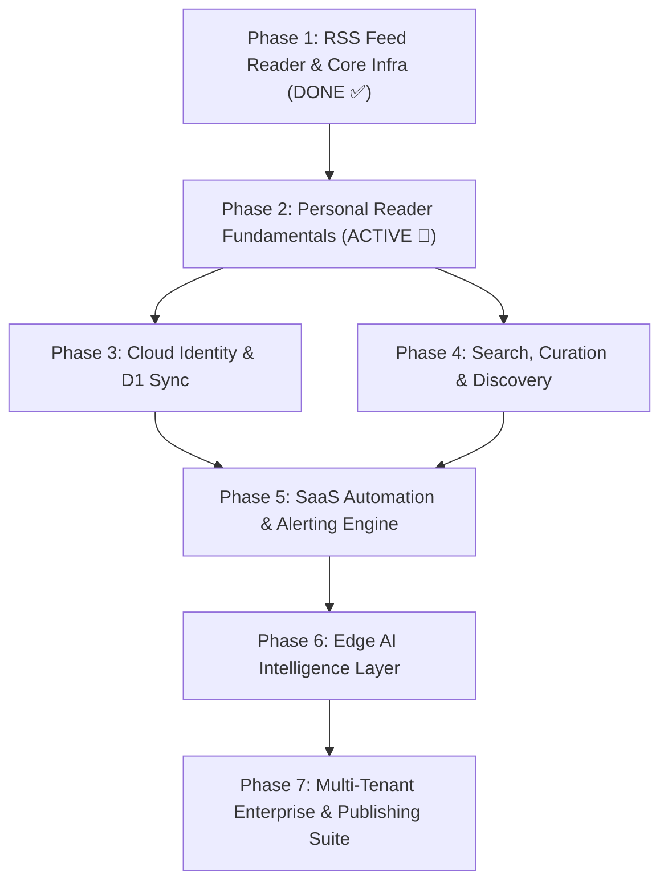

# FeedOmeter Product Evolution: Master 7-Phase Project Plan & Linear Roadmap

**Document:** 7-Phase Engineering Work Breakdown Structure (WBS) & Linear Roadmap  
**Version:** 2.2 (Realigned to Personal Feed Intelligence Platform Architecture)  
**Date:** September 18, 2026  
**Status:** Approved & Synchronized with Linear Workspace  
**Import File:** `Linear_Import_FeedOmeter_Roadmap.csv`  

---

## 1. Executive Summary & Product Strategy

This Master Project Plan operationalizes the complete FeedOmeter SaaS journey across **7 structured phases** totaling **39 engineering tasks**.

### Core Product Philosophy:
* **Public = Reader (Anonymous):** Browse catalog, open feed streams, read articles, evaluate the product with sub-10ms edge caching.
* **Authenticated = Owner (Logged-in):** Follow feeds, create folders, build custom stream fusions, star articles, read later, track history, save newsletters, receive AI summaries.
* **Mandatory Login for Personal Features:** Nothing personal exists without authentication, ensuring a pristine relational D1 data model from Day 1.

### Architectural Directives:
* **One Worker Deployment, Modular Internal Structure:** Decoupled `modules/` and `services/` under a single Cloudflare Worker deployment.
* **10–15% Pure Presentation Frontend:** Centralized `:root` design tokens, typography H1-H6, and standardized OOPS button/card inheritance.
* **Stream Engine First:** High-speed parallel feed fusion, cross-feed deduplication, and normalized JSON output.

---

## 2. Detailed 7-Phase Work Breakdown Structure (WBS)

### Phase 1: RSS Feed Reader & Infrastructure Foundation *(COMPLETED / 100% DONE ✅)*

| Task ID | Task Title | Status | Tier | Priority | Est (Pts) | Key Deliverables & Acceptance Criteria |
| :--- | :--- | :---: | :---: | :---: | :---: | :--- |
| **P1-01** | Domain & Cloud Infrastructure Setup | ✅ Done | Tier 1 | Urgent | 3 | Registered feedometer.com on Hostinger, configured Cloudflare DNS, SSL/TLS certificates, custom apex/www domain routing, and Cloudflare Pages hosting. |
| **P1-02** | GitHub Repository & Production Build Pipeline | ✅ Done | Tier 1 | High | 3 | Initialized GitHub repository, configured branch workflows, and implemented automated production minification engine (build.js) achieving -38% payload reduction. |
| **P1-03** | Cloudflare D1 Database & KV Schema Architecture | ✅ Done | Tier 1 | High | 4 | Created feedometer-db D1 database, defined publishers, feeds, and notify_signups tables with unique indexes, and bound FEEDS_KV for multi-tier global caching. |
| **P1-04** | Cloudflare Edge Worker API & Routing Engine | ✅ Done | Tier 1 | Urgent | 5 | Engineered stateless feedometer-worker.js with sub-10ms Edge Cache API (caches.default), KV fallback, /api/view, /api/catalog, /api/og, and /api/waitlist routes. |
| **P1-05** | Universal XML Parsing & Layer A Image Extraction | ✅ Done | Tier 1 | High | 4 | Built universal namespace-agnostic RSS 2.0 / Atom 1.0 parser with deep extraction for Media RSS (<media:content>, <media:thumbnail>), iTunes enclosures, and inline . |
| **P1-06** | URL Canonicalization, Deduplication & Safety Moderation | ✅ Done | Tier 1 | High | 3 | Implemented tracking parameter stripping (utm_*, fbclid), canonical article URL generation, atomic title-hash deduplication, and automated hate speech/extremism content filter. |
| **P1-07** | Server-Side Async Hero Image Enrichment & KV Caching | ✅ Done | Tier 1 | High | 4 | Added non-blocking ctx.waitUntil OpenGraph hero image extraction with per-article KV caching (og:<url>, 7-day TTL), eliminating all client-side scraping loops. |
| **P1-08** | Dynamic 25-Outlet Publisher Directory & D1 Seeding | ✅ Done | Tier 1 | High | 3 | Seeded 25 curated news publishers and sub-topics into D1 (seed_publishers.sql) with edge-cached /api/catalog route, stripping all hardcoded catalog JSON from frontend. |
| **P1-09** | Pure Presentation Frontend & Master Design System | ✅ Done | Tier 1 | High | 4 | Refactored feedometer-viewer.js to pure presentation (fetch -> render), declared master :root design tokens, standardized typography H1-H6, and unified .btn / .badge schemas. |

### Phase 2: Personal Reader Fundamentals *(ACTIVE CURRENT SPRINT 🚀)*

| Task ID | Task Title | Status | Tier | Priority | Est (Pts) | Key Deliverables & Acceptance Criteria |
| :--- | :--- | :---: | :---: | :---: | :---: | :--- |
| **P2-01** | Authentication Foundation | ⏳ Todo | Tier 1 | Urgent | 4 | Implement D1 user and session tables (users, sessions). Build password hashing (salted SHA-256), bearer token generation, session verification, POST /api/auth/register, POST /api/auth/login, POST /api/auth/logout, and GET /api/me to establish authenticated owner accounts from Day 1. |
| **P2-02** | Stream Engine (The Heart) | ⏳ Todo | Tier 1 | Urgent | 5 | Build the core Stream Engine (/api/stream). Delivers multi-feed fusion (10 feeds -> 1 unified stream), universal JSON normalization ({id, title, summary, link, published, source, image}), cross-feed deduplication, and sub-100ms chronological sorting backed by multi-tier caching. |
| **P2-03** | User Feed Management & Folders | ⏳ Todo | Tier 1 | Urgent | 3 | Implement D1-backed user subscriptions and folder hierarchy (user_sources, folders). Expose POST /api/follow, POST /api/unfollow, POST /api/folders/create, POST /api/folders/update, GET /api/my-feeds, and GET /api/my-folders with strict token authentication. |
| **P2-04** | Feed Discovery Engine | ⏳ Todo | Tier 1 | High | 3 | Build keyword and catalog search engine (/api/discover?q=...). Queries D1 catalog with verified badges, presents category starter pills (News, Tech, Finance, AI, EV), and returns suggested feeds for rapid user acquisition. |
| **P2-05** | Universal Website Feed Builder & Newsletter Resolver | ⏳ Todo | Tier 1 | High | 4 | Build universal website-to-feed ingestion tool (/api/builder). Probes input URLs, inspects <link rel="alternate"> headers, auto-resolves creator platforms (Substack, Beehiiv, Ghost, Medium), and provides fallback Edge HTML article extraction with live preview. |
| **P2-06** | Personal Reader Actions (Starred, Read Later, History) | ⏳ Todo | Tier 1 | High | 3 | Implement D1 tables for starred_articles, saved_articles, and read_history. Provide 1-click Star, Save Later, and Read/Unread tracking with endpoints POST /api/star, POST /api/save, GET /api/my-starred, GET /api/my-saved, and POST /api/read-history. |
| **P2-07** | Thematic Collections Engine | ⏳ Todo | Tier 1 | High | 3 | Build custom thematic collections (collections, collection_sources). Enables users to bundle related feeds into specialized topic collections and generate collection-filtered composite streams (/api/collections/:id/stream). |

### Phase 3: Cloud Identity, D1 Persistence & Device Sync 

| Task ID | Task Title | Status | Tier | Priority | Est (Pts) | Key Deliverables & Acceptance Criteria |
| :--- | :--- | :---: | :---: | :---: | :---: | :--- |
| **P3-01** | Passwordless Magic Link & OAuth Authentication | 📋 Backlog | Tier 1 | High | 4 | Expand auth subsystem to support 1-click Magic Email Login (via Resend/Postmark) and Google/GitHub OAuth integrations with D1 user mapping. |
| **P3-02** | Bidirectional Cloud Sync Engine (D1 ◄► Local) | 📋 Backlog | Tier 1 | High | 4 | Build automatic background synchronization between client state and Cloudflare D1 database, ensuring instant multi-device continuity and offline resilience. |
| **P3-03** | User Profile & Persistent Cloud Preferences | 📋 Backlog | Tier 1 | Medium | 2 | Store user layout preferences, reading theme (dark/light/sepia), refresh frequencies, and default start pages in D1 user settings. |
| **P3-04** | Multi-Device Session Management & Live Broadcast | 📋 Backlog | Tier 1 | Medium | 2 | Handle secure HTTP-only session cookies and cross-tab BroadcastChannel communication for instant multi-tab status synchronization. |

### Phase 4: Search, Curation & Discovery Platform 

| Task ID | Task Title | Status | Tier | Priority | Est (Pts) | Key Deliverables & Acceptance Criteria |
| :--- | :--- | :---: | :---: | :---: | :---: | :--- |
| **P4-01** | Global Feed Directory & Autodiscovery Search | 📋 Backlog | Tier 1 | High | 3 | Enhance feed search modal with category exploration, popularity rankings from D1, and real-time website URL RSS autodiscovery. |
| **P4-02** | Saved Searches & Dynamic Smart Feeds | 📋 Backlog | Tier 2 | Medium | 3 | Allow users to save recurring search queries as dynamic "Smart Feeds" that automatically aggregate matching articles across all subscribed feeds. |
| **P4-03** | Multi-Dimensional Article Tags & Categories | 📋 Backlog | Tier 2 | Medium | 3 | Implement custom tag pills on articles with tag filtering, allowing multi-label cross-categorization outside traditional folder hierarchies. |
| **P4-04** | Public Collections & Shareable Reading Lists | 📋 Backlog | Tier 2 | Medium | 3 | Generate unique public share links for user-curated feed bundles or article collections with custom branded landing cards. |
| **P4-05** | Feed Health, Uptime & Latency Diagnostics | 📋 Backlog | Tier 1 | Low | 2 | Provide an automated health monitoring dashboard showing feed response times, HTTP status codes, and last-successful-fetch timestamps. |

### Phase 5: SaaS Automation, Alerting & Integrations 

| Task ID | Task Title | Status | Tier | Priority | Est (Pts) | Key Deliverables & Acceptance Criteria |
| :--- | :--- | :---: | :---: | :---: | :---: | :--- |
| **P5-01** | Edge Rules & Boolean Query Parser Engine | 📋 Backlog | Tier 2 | High | 4 | Build a serverless edge evaluation engine in Cloudflare Worker with full Boolean AST evaluation (AND, OR, NOT, exact quotes, nested parentheses, field targeting title:, source:, author:). |
| **P5-02** | Notification Dispatcher (Email & Web Push) | 📋 Backlog | Tier 2 | High | 4 | Integrate real-time notification dispatching supporting Web Push API (VAPID) and instant email alerts via transactional mail API. |
| **P5-03** | Outbound Webhook Dispatcher | 📋 Backlog | Tier 3 | Medium | 3 | Trigger secure JSON POST webhook payloads to custom HTTP endpoints whenever high-priority keyword or filter rules match incoming articles. |
| **P5-04** | SaaS Integrations (Slack, Discord, Teams, Zapier) | 📋 Backlog | Tier 2 | Medium | 4 | Pre-built webhook connectors formatting article rich cards directly into Slack channels, Discord webhooks, Microsoft Teams, and Zapier triggers. |
| **P5-05** | Newsletter Digest Builder Studio | 📋 Backlog | Tier 2 | Low | 4 | A visual newsletter creator that compiles top starred/curated articles of the week into a responsive HTML email digest. |

### Phase 6: Edge AI Intelligence Layer 

| Task ID | Task Title | Status | Tier | Priority | Est (Pts) | Key Deliverables & Acceptance Criteria |
| :--- | :--- | :---: | :---: | :---: | :---: | :--- |
| **P6-01** | 1-Click Executive AI Article Summaries | 📋 Backlog | Tier 3 | High | 3 | Integrate Cloudflare Workers AI (@cf/meta/llama-3-8b-instruct) to generate concise 2-bullet executive summaries directly inside article cards with KV response caching. |
| **P6-02** | AI Topic Clustering & Semantic De-duplication | 📋 Backlog | Tier 3 | Medium | 4 | Use Cloudflare Vectorize / Text Embeddings to cluster breaking news stories across multiple publishers into single aggregated topic streams. |
| **P6-03** | Brand, Competitor & Executive Tracker | 📋 Backlog | Tier 3 | Medium | 4 | Automated entity extraction and sentiment analysis tracking specific companies, brand mentions, and executive announcements across global feeds. |
| **P6-04** | AI Research Assistant & Interactive Q&A | 📋 Backlog | Tier 3 | Low | 4 | Interactive AI chatbot enabling users to ask questions, extract key takeaways, and synthesize trends across saved article collections. |

### Phase 7: Multi-Tenant Enterprise, Workspaces & APIs 

| Task ID | Task Title | Status | Tier | Priority | Est (Pts) | Key Deliverables & Acceptance Criteria |
| :--- | :--- | :---: | :---: | :---: | :---: | :--- |
| **P7-01** | Multi-Tenant Team Workspaces Architecture | 📋 Backlog | Tier 3 | Medium | 4 | Implement multi-tenant workspace partitioning in Cloudflare D1 with workspace switcher, shared feed collections, and team member management. |
| **P7-02** | Role-Based Access Control (Admin/Editor/Viewer) | 📋 Backlog | Tier 3 | Medium | 3 | Granular permissions granting Admins billing/member management, Editors feed/rule curation, and Viewers read-only dashboard access. |
| **P7-03** | Enterprise SSO (SAML / OIDC) & Audit Logs | 📋 Backlog | Tier 3 | Low | 4 | Single Sign-On integration via Cloudflare Access / Okta / Azure AD with comprehensive compliance audit logging for team actions. |
| **P7-04** | Developer Public REST API & API Key Management | 📋 Backlog | Tier 3 | Low | 3 | Expose secure REST API with API key token generation, rate limiting, and OpenAPI/Swagger interactive documentation. |
| **P7-05** | Embeddable Widget Studio & Live Visual Publishing Modes | 📋 Backlog | Tier 3 | High | 4 | Visual widget builder offering 6 layout modes (News Wall, Breaking News Ticker, Carousel Slider, Magazine Grid, Imageboard, Classic List) and responsive iframe embed snippet generation. |

---

## 3. Phase Dependency & Critical Path Diagram

