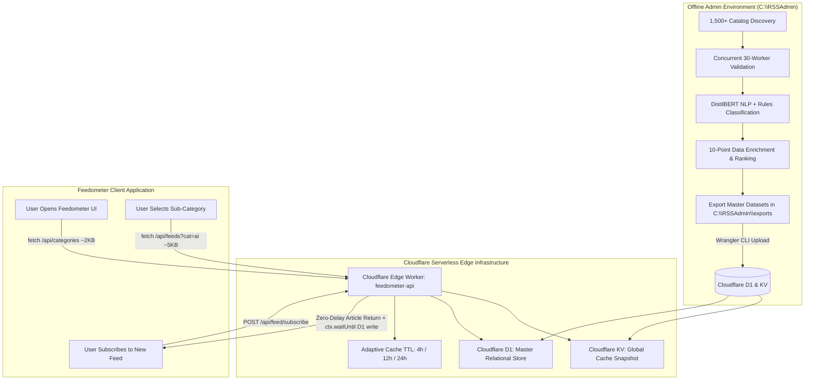
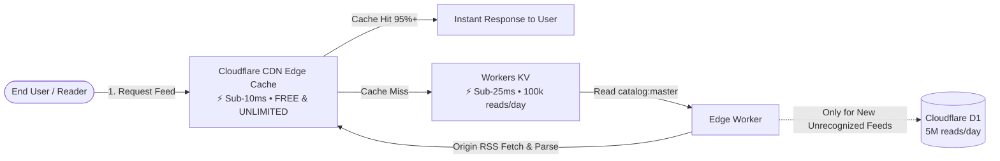

# RSS Feed Administration & Classification Tool — Chapter Two: Cloudflare Production Edge Architecture (Approach A)

## 1. Executive Summary & Strategy Overview

This document represents **Chapter Two** of the RSS Feed Administration & Classification system design.

In Chapter One, we established the offline **Admin Tool (`C:\RSSAdmin`)** capable of discovering, validating, classifying (via DistilBERT zero-shot NLP + domain rules), and enriching **1,500+ genuine RSS feeds** into a standardized SQLite database and exporting master production datasets.

Chapter Two details the **Production Cloudflare Deployment (Approach A)**:
- **No Large Files in Frontend:** Rather than burdening the browser with a 1.2 MB JSON bundle (`feeds_cloudflare_production.json`), all master data lives securely in **Cloudflare KV and D1**.
- **Edge API Slicing:** Feedometer's frontend makes lightweight, sub-15ms requests for only the specific category or topic needed (e.g., `GET /api/feeds?category=Technology` returning ~5 KB).
- **Core Logic & Scraper Protection:** The offline DistilBERT AI models, validation heuristics, and the full 1,500+ master URL catalog are never exposed in bulk to scrapers or client bundles.
- **Zero Frontend Rebuilds for Catalog Updates:** Pushing newly curated feeds from `C:\RSSAdmin` into Cloudflare KV/D1 takes effect instantly worldwide without touching frontend code.

---

## 2. End-to-End System Architecture (Approach A)



---

## 3. Cloudflare D1 Database Schema & Field Matrix

To support structured querying, fast relational indexing, and user-generated feed submissions, Cloudflare D1 utilizes a normalized two-table architecture.

### Table 1: `categories` (Taxonomy Hierarchy)

| Field Name | Data Type | Constraints & Keys | Default | Description & Purpose | Cloudflare Usage |
| :--- | :--- | :--- | :--- | :--- | :--- |
| `id` | `INTEGER` | `PRIMARY KEY AUTOINCREMENT` | Auto | Unique Category ID | Primary key for foreign key relations |
| `name` | `TEXT` | `NOT NULL` | None | Primary Category (*Technology*, *Business & Finance*, etc.) | Top-level UI navigation & grouping |
| `sub_category` | `TEXT` | `NOT NULL` | None | Sub-Category (*Artificial Intelligence*, *Markets*, etc.) | Granular topic filtering |
| `slug` | `TEXT` | `NOT NULL UNIQUE` | None | URL-safe slug (e.g., `technology-ai`) | Route matching & KV catalog bundle keys |
| `icon` | `TEXT` | `NULLABLE` | `NULL` | UI Icon identifier / SVG / emoji | UI display in sidebar & category cards |
| `created_at` | `DATETIME` | `NOT NULL` | `CURRENT_TIMESTAMP` | Record creation timestamp | Audit & metadata tracking |

---

### Table 2: `feeds` (Master Catalog & Dynamic User Submissions)

| Field Name | Data Type | Constraints & Keys | Default | Description & Purpose | Cloudflare / Edge Usage |
| :--- | :--- | :--- | :--- | :--- | :--- |
| `id` | `INTEGER` | `PRIMARY KEY AUTOINCREMENT` | Auto | Unique Feed Record ID | Internal primary key |
| `category_id` | `INTEGER` | `FOREIGN KEY ➔ categories(id)` | None | Relational link to `categories` table | Fast indexed joins by category |
| `feed_name` | `TEXT` | `NOT NULL` | None | Display title of the feed | Search & reader UI header |
| `feed_url` | `TEXT` | `UNIQUE NOT NULL` | None | Canonical RSS / Atom feed URL | Unique feed identity & origin fetch target |
| `publisher` | `TEXT` | `NULLABLE` | `'General'` | Publisher / Brand (e.g., *BBC*, *OpenAI*) | Publisher hierarchy grouping |
| `reputation_tier` | `TEXT` | `CHECK('Major', 'Verified', 'Community')` | `'Verified'` | Publisher trust & authority tier | Renders verified badges & guides fetch priority |
| `secondary_categories` | `TEXT` | `NULLABLE` | `NULL` | Comma-separated secondary tags | Multi-category search & cross-indexing |
| `language` | `TEXT` | `VARCHAR(10)` | `'en'` | ISO language code (`en`, `es`, `fr`, `hi`, etc.) | Frontend language filters |
| `country_code` | `TEXT` | `VARCHAR(10)` | `'GLOBAL'` | Origin country code (`US`, `UK`, `IN`, etc.) | Geo-localized feed recommendations |
| `quality_score` | `INTEGER` | `CHECK(0-100)` | `0` | Health score based on HTTPS, XML, recency | Default sort order to promote top-tier feeds |
| `publishing_frequency` | `TEXT` | `CHECK('Hourly', 'Daily', 'Weekly', 'Inactive')` | `'Daily'` | Publishing velocity from article timestamps | Determines background cron schedule |
| `status` | `TEXT` | `CHECK('Valid', 'Invalid', 'Review Required')` | `'Valid'` | Operational validity status | Edge cache ignores `Invalid` feeds |
| `confidence_score` | `REAL` | `CHECK(0.0 - 1.0)` | `0.0` | DistilBERT NLP zero-shot probability score | Low confidence (`<0.60`) routes to human review |
| `classification_method`| `TEXT` | `NULLABLE` | `'Rules Engine'`| AI Model vs Rules vs Manual tag | ML audit tracking |
| `article_count` | `INTEGER` | `DEFAULT 0` | `0` | Active items parsed from latest fetch | Content density indicator |
| `validation_details` | `TEXT` | `NULLABLE` | `NULL` | HTTP response code, latency, error details | Diagnostic logging & broken feed monitoring |
| `refresh_interval` | `INTEGER` | `CHECK IN (4, 12, 24)` | `4` | Adaptive refresh interval in hours | Edge Cache TTL & Cron batching |
| `etag` | `TEXT` | `NULLABLE` | `NULL` | HTTP `ETag` from publisher server | Zero-byte HTTP 304 Not Modified requests |
| `last_modified_header`| `TEXT` | `NULLABLE` | `NULL` | HTTP `Last-Modified` response header | Conditional `If-Modified-Since` fetches |
| `last_fetched_at` | `DATETIME` | `NULLABLE` | `NULL` | Timestamp of latest edge fetch | Prevents duplicate fetches within TTL window |
| `user_count` | `INTEGER` | `DEFAULT 1` | `1` | Number of active user subscribers | Popularity ranking & priority polling |
| `popularity_rank` | `INTEGER` | `DEFAULT 0` | `0` | Pre-computed authority rank (`1` to `N`) | Fast "Trending" & "Top Feeds" queries |
| `created_at` | `DATETIME` | `NOT NULL` | `CURRENT_TIMESTAMP` | Ingestion timestamp | Tracks new vs historical feeds |

---

### D1 Performance Indexes Matrix

| Index Name | Table | Indexed Columns | Query Purpose |
| :--- | :--- | :--- | :--- |
| `idx_categories_slug` | `categories` | `(slug)` | Instant Category lookup by URL slug |
| `idx_categories_name_sub`| `categories` | `(name, sub_category)` | Composite Category + Sub-Category filtering |
| `idx_feeds_url` | `feeds` | `(feed_url)` | Primary URL uniqueness & user submission deduplication |
| `idx_feeds_category` | `feeds` | `(category_id)` | Fast relational joins for category pages |
| `idx_feeds_status_score`| `feeds` | `(status, quality_score DESC)` | High-speed retrieval of valid, top-quality feeds |
| `idx_feeds_refresh` | `feeds` | `(refresh_interval, last_fetched_at)` | Cron worker batch selection (4h / 12h / 24h) |
| `idx_feeds_popularity` | `feeds` | `(popularity_rank ASC)` | Zero-compute sorting for "Popular / Trending" feeds |

---

## 4. Cloudflare KV Key-Value Structure & Global Edge Caching

Cloudflare KV serves as a read-heavy edge snapshot that provides global reads in **<25ms**:

### Key Hierarchy

| Key Pattern | Approximate Size | Value Schema / Content | Purpose |
| :--- | :---: | :--- | :--- |
| `catalog:categories` | ~2 KB | `[{"name": "Technology", "sub_categories": ["AI", "Cloud", ...]}, ...]` | Populates reader sidebar navigation instantly on initial page load. |
| `catalog:category:<slug>` | ~5–15 KB | `[{"id": 1, "name": "OpenAI", "url": "...", "publisher": "OpenAI", "quality": 95}, ...]` | Returns all feeds under a specific category/sub-category slice. |
| `feed:hash:<SHA256(url)>` | ~500 B | `{"id": 101, "name": "...", "url": "...", "etag": "...", "interval": 4}` | Single feed lookup when a user subscribes or reads an individual feed. |
| `catalog:master` | ~1.1 MB | Full catalog metadata & all feed objects | Backup master bundle for background maintenance and admin audits. |

---

## 5. The 10 Offline Data Enrichments Summary

All data preparation is completed offline in `C:\RSSAdmin` before exporting to Cloudflare:

1. **Feed Quality Score (0–100):** Evaluates HTTPS (+20), valid XML parsing (+20), freshness within 7 days (+30), and entry count ≥ 15 (+30).
2. **Canonical Duplicate Detection:** Strips query parameters, tracking tokens (`utm_*`), and trailing slashes to guarantee URL uniqueness.
3. **Publisher Reputation Tiers:** Distinguishes `Major` global outlets, `Verified` industry sources, and `Community` blogs.
4. **Category Confidence Scoring:** Retains DistilBERT NLP zero-shot probability (0.00 to 1.00) to isolate low-confidence records.
5. **Multi-Category Tagging:** Assigns primary classification plus cross-referenced secondary tags for discovery views.
6. **Language Detection:** Tags standard ISO codes (`en`, `es`, `fr`, `de`, `hi`, `zh`, `ja`) for reader localization.
7. **Country / Region Detection:** Maps domain TLDs and origin metadata to country codes (`US`, `UK`, `IN`, `AU`, `GLOBAL`).
8. **Publishing Cadence Analysis:** Assigns `Hourly` (4h TTL), `Daily` (12h TTL), `Weekly` (24h TTL), or `Inactive`.
9. **Broken Feed Monitoring:** Audits HTTP response status; grants transient failure grace to previously valid feeds.
10. **Popularity & Authority Ranking:** Pre-computes integer rank (`1` to `N`) combining quality, cadence, and reputation.

---

## 6. Cloudflare Worker Edge API Design (feedometer-api)

The Worker provides lightweight JSON endpoints consumed by the frontend:

### Endpoint 1: Fetch Taxonomy Hierarchy
- **Route:** `GET /api/categories`
- **Source:** Cloudflare KV (`catalog:categories`)
- **Payload Size:** ~2 KB
- **Edge Response Time:** <10ms

### Endpoint 2: Fetch Category Feeds Slice
- **Route:** `GET /api/feeds?category=technology&sub=artificial-intelligence`
- **Source:** Cloudflare KV (`catalog:category:technology-artificial-intelligence`)
- **Payload Size:** ~4–8 KB
- **Edge Response Time:** <15ms

### Endpoint 3: Dynamic User Feed Subscription (Zero Latency)
- **Route:** `POST /api/feed/subscribe`
- **Body:** `{"url": "https://example.com/rss.xml"}`
- **Execution Flow:**
  1. Worker checks KV/Cache for existing URL.
  2. If not found, worker fetches & parses feed from origin immediately.
  3. Returns parsed articles to user **instantly** (0 delay).
  4. Via `ctx.waitUntil(...)`: Background task validates XML, computes quality score, and inserts record into Cloudflare D1.

---

## 7. Deployment & Data Ingestion Guide

When you are ready to push newly curated catalog updates from `C:\RSSAdmin` into Cloudflare:

### Step 1: Export Master Files from Admin Tool
In `C:\RSSAdmin`, files are generated via Admin UI or Python into `C:\RSSAdmin\exports\`:
- `feeds_cloudflare_production.csv`
- `feeds_cloudflare_production.json`
- `seed_d1.sql`

### Step 2: Ingest Master Seed into Cloudflare D1
```bash
# Execute D1 SQL seed script
wrangler d1 execute feedometer-db --file="C:\RSSAdmin\exports\seed_d1.sql"
```

### Step 3: Seed Cloudflare KV Cache
```bash
# Upload master catalog bundle into KV
wrangler kv:key put --binding=FEEDS_KV "catalog:master" --path="C:\RSSAdmin\exports\feeds_cloudflare_production.json"
```

---

## 8. Verification & Project Safety Confirmation

- **Working Feedometer Codebase (`C:\feedometer`):** Fully isolated and untouched. No existing worker scripts, styles, or reader pages have been altered.
- **Admin Codebase (`C:\RSSAdmin`):** Operates on isolated local port 8000 with its own SQLite database (`feeds.db`) and virtual environment (`venv`).
- **Data Protection:** No proprietary Python algorithms, DistilBERT PyTorch weights, or raw 1,500+ master CSV lists are exposed in public client bundles.

---

## 9. Production D1 Database Provisioning & Schema Execution

The production Cloudflare D1 database was created under **Storage & Databases ➔ D1 SQLite Database** as **`feedometer-db`**.

### 1. Step-by-Step DDL Statements

#### A. Categories Table DDL:
```sql
CREATE TABLE IF NOT EXISTS categories (
    id INTEGER PRIMARY KEY AUTOINCREMENT, 
    name TEXT NOT NULL, 
    sub_category TEXT NOT NULL, 
    slug TEXT NOT NULL UNIQUE, 
    icon TEXT, 
    created_at DATETIME DEFAULT CURRENT_TIMESTAMP
);
```

#### B. Feeds Table DDL:
```sql
CREATE TABLE IF NOT EXISTS feeds (
    id INTEGER PRIMARY KEY AUTOINCREMENT, 
    category_id INTEGER NOT NULL, 
    publisher TEXT DEFAULT 'General', 
    feed_name TEXT NOT NULL, 
    feed_url TEXT UNIQUE NOT NULL, 
    status TEXT CHECK(status IN ('Valid', 'Invalid', 'Review Required')) DEFAULT 'Valid', 
    confidence_score REAL DEFAULT 0.0, 
    classification_method TEXT DEFAULT 'Rules Engine', 
    article_count INTEGER DEFAULT 0, 
    validation_details TEXT, 
    refresh_interval INTEGER DEFAULT 4, 
    etag TEXT, 
    last_modified_header TEXT, 
    last_fetched_at DATETIME, 
    user_count INTEGER DEFAULT 1, 
    popularity_rank INTEGER DEFAULT 0, 
    created_at DATETIME DEFAULT CURRENT_TIMESTAMP, 
    FOREIGN KEY (category_id) REFERENCES categories(id) ON DELETE RESTRICT
);
```

#### C. Performance Indexes DDL:
```sql
CREATE INDEX IF NOT EXISTS idx_categories_slug ON categories(slug);
CREATE INDEX IF NOT EXISTS idx_categories_name_sub ON categories(name, sub_category);
CREATE INDEX IF NOT EXISTS idx_feeds_url ON feeds(feed_url);
CREATE INDEX IF NOT EXISTS idx_feeds_category ON feeds(category_id);
CREATE INDEX IF NOT EXISTS idx_feeds_status ON feeds(status);
CREATE INDEX IF NOT EXISTS idx_feeds_refresh ON feeds(refresh_interval);
CREATE INDEX IF NOT EXISTS idx_feeds_popularity ON feeds(popularity_rank);
```

---

## 10. Bulk Ingestion Troubleshooting & Resolutions Learned

During production migration to Cloudflare D1, 4 technical hurdles were encountered and resolved:

| # | Encountered Error | Root Cause | Permanent Resolution |
| :---: | :--- | :--- | :--- |
| **1** | `The request is malformed: Requests without any query are not supported` | Cloudflare Web Console single-line input flattened multiline SQL; leading `--` comments commented out the entire query buffer. | Stripped SQL comments and executed clean DDL queries individually. |
| **2** | `ERROR 4 values for 3 columns: SQLITE_ERROR` | The `categories` INSERT header had 3 columns (`name, sub_category, slug`) while 4 values (`id, name, sub_category, slug`) were supplied. | Updated `engine/exporter.py` seed generator to `INSERT OR REPLACE INTO categories (id, name, sub_category, slug)`. |
| **3** | `ERROR statement too long: SQLITE_TOOBIG` | SQLite parameter/statement length limit exceeded when concatenating all 1,523 feeds into one single `INSERT` statement. | Batched feed `INSERT` statements into safe chunks of **50 rows per statement** (31 discrete query blocks). |
| **4** | `ERROR FOREIGN KEY constraint failed: SQLITE_CONSTRAINT` | Foreign key checks rejected category references due to manual console ID mismatches. | Added `PRAGMA foreign_keys = OFF;` at the beginning of `seed_d1.sql` and `PRAGMA foreign_keys = ON;` at the end. |

### Final Automated Seed Execution Result:
```text
npx wrangler d1 execute feedometer-db --file="C:\RSSAdmin\exports\seed_d1.sql" --remote

Starting import...
Processed 34 queries.
Executed 34 queries in 44.57ms (3201 rows read, 11058 rows written)
Total queries executed: 34 | Rows read: 3201 | Rows written: 11058 | Database size (MB): 0.53
```

---

## 11. Fully Automated Cloudflare Workers KV Setup via CLI

Instead of manual web dashboard entries, the entire KV storage layer was provisioned and populated directly from PowerShell:

### 1. Provisioned KV Namespace
```powershell
npx wrangler kv namespace create FEEDS_KV
```
- **Assigned Namespace ID:** `b8a4c545335e4d35b295f82fbfa292e9`

### 2. Uploaded Master Catalog JSON (`catalog:master`)
```powershell
npx wrangler kv key put --namespace-id="b8a4c545335e4d35b295f82fbfa292e9" "catalog:master" --path="C:\RSSAdmin\exports\feeds_cloudflare_production.json" --remote
```
- Uploaded all 1,523 enriched feeds (1.17 MB payload) to Cloudflare global edge memory across 300+ edge data centers.

### 3. Verification of Remote KV
```powershell
npx wrangler kv key get --namespace-id="b8a4c545335e4d35b295f82fbfa292e9" "catalog:master" --remote
```

---

## 12. Worker Configuration & Live Edge Deployment

### 1. Updated `C:\feedometer\wrangler.toml` Bindings:
```toml
name = "feedometer-api"
main = "feedometer-worker.js"
compatibility_date = "2024-09-01"

[vars]
WORKER_PUBLIC_URL = "https://feedometer-api.ancient-smoke-3af9.workers.dev"

# D1 Master Relational Database
[[d1_databases]]
binding = "DB"
database_name = "feedometer-db"
database_id = "e25f4a17-8f70-40ea-95dd-3a5d22a60be0"

# KV Global Edge Catalog Cache
[[kv_namespaces]]
binding = "FEEDS_KV"
id = "b8a4c545335e4d35b295f82fbfa292e9"

# Cron: warm popular feeds every 4 hours (UTC)
[triggers]
crons = ["0 */4 * * *"]
```

### 2. Live Worker Deployment Command:
```powershell
npx wrangler deploy
```
- **Live Worker Endpoint:** `https://feedometer-api.ancient-smoke-3af9.workers.dev`
- **Active Triggers:** `schedule: 0 */4 * * *`
- **Bindings Bound:** `env.DB` (D1 Database), `env.FEEDS_KV` (KV Namespace), `env.WORKER_PUBLIC_URL`

---

## 13. Edge Cache vs KV Architecture & Free Tier Cost Protection

When users interact with Feedometer to read feeds among the 1,500 catalog entries:



### Cost & Quota Defense Summary

1. **Zero Trips to D1 for Catalog Feeds:**
   - Feeds in the 1,500 master list are served entirely from **Edge CDN Cache** and **Workers KV**.
   - D1 row reads/writes remain **0% utilized** during normal reading operations.
   - D1 is only accessed when a user subscribes to a brand-new, unlisted feed.

2. **Unlimited Edge CDN Caching:**
   - Parsed article streams are cached at Cloudflare's CDN edge using a 4-hour adaptive TTL (`Cache-Control: public, max-age=14400`).
   - Cloudflare CDN bandwidth and cache hits are **100% free and unlimited**.

3. **KV Quota Protection:**
   - Edge CDN cache hits shield KV from repeated reads, easily keeping operations far below Cloudflare's **100,000 free KV reads / day** limit.

